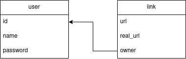

= ls, Link shortener

A https://flask.palletsprojects.com/[flask] and python based shortener.
The ui use https://getuikit.com/[uikit]

== Roadmap :

* [ ] View of actual link
* [ ] Statistics
* [ ] Oauth

== Config :

The project use toml, because toml is cool.
The default path is `config.yaml`, you can change it by `LS_CONFIG_PATH` variable.
Example config :

[,toml]
----
database = "db.sql"
secret_key = "dev"
debug = true
admin_domain = "admin.localhost"
shortener_domain = "localhost"
listen_port = 5000
minimum_password_length = 16 # Default is 12
root_redirect = "https://example.org"
----

== Project structure

=== Database schema

